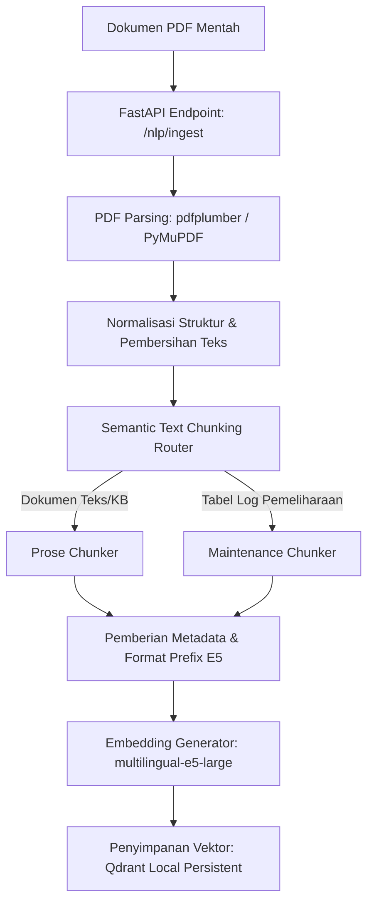

# BAB IV
# HASIL DAN PEMBAHASAN (MODUL NLP & GENERATIVE AI)

## 4.2 Perancangan Sistem (Modul NLP & RAG)
Perancangan arsitektur logis untuk modul *Natural Language Processing* (NLP) dan *Retrieval-Augmented Generation* (RAG) pada Sistem PRIME dirancang untuk menyediakan asisten pintar pemeliharaan prediktif bagi teknisi industri manufaktur. Modul ini bertugas menerima kueri bahasa alami dari teknisi, mencari informasi pemeliharaan historis dan panduan manual (*SOP*) yang relevan, mengintegrasikan data kondisi sensor waktu-nyata (*real-time*), dan merangkumnya menjadi rekomendasi perbaikan terstruktur yang akurat serta dapat dipertanggungjawabkan (*grounded*).

Secara logis, modul NLP dan RAG ini dibagi menjadi dua alur kerja utama: **Alur Ingestion (Offline)** dan **Alur Query (Online)**.

### 4.2.1 Arsitektur Logis Ingestion (Offline)
Alur ini dirancang untuk memproses dokumen panduan manual (*SOP*) berbentuk PDF statis dan catatan riwayat pemeliharaan permesinan sebelum disimpan ke basis data vektor. Diagram alur logis pengolahan dokumen disajikan pada Gambar 4.1.


*Gambar 4.1 Diagram Alur Logis Pemrosesan Ingestion Dokumen*

### 4.2.2 Arsitektur Logis Query (Online)
Alur ini aktif saat teknisi mengirimkan pertanyaan melalui antarmuka pengguna (*user interface*). Proses pencarian informasi dan pembuatan jawaban mengikuti tahapan berikut:
1. **Query Routing**: Kueri diklasifikasikan ke dalam 4 mode pencarian: `general` (umum), `machine_specific` (spesifik mesin tertentu), `historical` (riwayat), dan `multi_machine` (banyak mesin).
2. **Hybrid Retrieval**: Melakukan pencarian paralel menggunakan metode *Dense Retrieval* (pencarian semantik pada Qdrant) dan *Sparse Retrieval* (pencarian kata kunci menggunakan BM25). Hasil pencarian dari kedua metode digabungkan menggunakan algoritma *Reciprocal Rank Fusion* (RRF).
3. **Cross-Encoder Reranking**: Mengurutkan kembali kandidat teks teratas menggunakan model *reranker* `ms-marco-MiniLM-L-6-v2` untuk menyaring 5 dokumen/tabel paling relevan.
4. **Live Context Injection**: Jika kueri mendeteksi indikasi identitas mesin (`machine_id`), sistem secara otomatis memanggil status sensor waktu-nyata (suhu, getaran, RPM, status, prediksi anomali) dari basis data memori Redis.
5. **Prompt Assembly**: Menggabungkan instruksi sistem, riwayat percakapan (*chat history*), data sensor waktu-nyata, kutipan teks dokumen teratas (*retrieved chunks*), dan pertanyaan awal pengguna menjadi satu kesatuan prompt utuh.
6. **LLM Generation**: Prompt dikirimkan ke model LLM `llama-3.1-8b-instant` via Groq API untuk menghasilkan jawaban yang terstruktur dengan format analisis, rekomendasi tindakan, serta referensi kutipan (*citations*).

---

## 4.3 Implementasi Sistem (Modul NLP & RAG)
Tahapan rekayasa perangkat lunak dan implementasi kode modul NLP & RAG Sistem PRIME dilaksanakan secara bertahap dalam 8 fase pengerjaan sebagai berikut:

### 4.3.1 Fase 1: Ingestion Dokumen dan Pra-pemrosesan
Implementasi fase pertama difokuskan pada ekstraksi teks bersih dari file PDF mentah. Kode utama diimplementasikan pada skrip `nlp/ingestion.py` dengan memanfaatkan pustaka `pdfplumber` sebagai pemroses utama dan `PyMuPDF` sebagai pengaman cadangan (*fallback*). Pipeline ini berhasil mengekstrak seluruh data teks dan 119 tabel terstruktur dari laporan operasional mesin M01-M20, serta menyimpannya dalam bentuk teks bersih dan berkas JSON terstruktur di direktori `nlp/data/processed/`.

### 4.3.2 Fase 2: Semantic Text Chunking
Implementasi chunking teks dirancang secara semantik untuk mencegah hilangnya konteks informasi. Dibuat kelas abstrak `BaseChunker` pada `nlp/chunking/base_chunker.py` yang diturunkan menjadi dua implementasi khusus:
* **`ProseChunker`**: Memotong dokumen naratif (seperti buku manual atau *SOP*) berdasarkan struktur bab/bagian.
* **`MaintenanceChunker`**: Memotong tabel log pemeliharaan yang memiliki struktur 7 kolom standar (`Tanggal, Log ID, Tipe, Catatan Teknisi, Downtime (Jam), Part Replaced, Cost (IDR)`). Setiap chunk dibatasi per 4-5 baris log dan diberikan metadata pelacak seperti `machine_id`, `month`, dan `event_type`.
Fase ini berhasil membagi seluruh dokumen menjadi 526 chunk terstruktur (520 chunk dari log pemeliharaan dan 6 chunk dari buku panduan).

### 4.3.3 Fase 3: Embedding dan Basis Data Vektor
Implementasi komputasi vektor dilakukan pada berkas `nlp/embeddings/embedder.py` menggunakan model pra-terlatih `intfloat/multilingual-e5-large` yang menghasilkan representasi vektor berdimensi 1024. Untuk meningkatkan performa pencarian, setiap teks chunk ditambahkan prefix khusus sesuai panduan model E5 (misalnya, `passage: ` untuk teks dokumen, dan `query: ` untuk input kueri pencarian). 
Penyimpanan vektor diimplementasikan pada `nlp/embeddings/vector_store.py` menggunakan basis data vektor Qdrant mode lokal yang persisten (*local persistent storage*). Proses pengindeksan seluruh 526 chunk selesai dalam waktu 113,4 detik di lingkungan pengembangan CPU (~4.6 chunks/detik).

### 4.3.5 Fase 4: Sistem Retrieval Hibrida dan Re-ranking
Sistem pencarian hibrida diimplementasikan untuk menggabungkan keunggulan pencarian semantik (*dense*) dan kecocokan kata kunci (*sparse*). Komponen utama yang dibangun meliputi:
* **`query_router.py`**: Mengarahkan jenis kueri secara otomatis untuk optimasi filter metadata permesinan.
* **`retriever.py`**: Melakukan query ke indeks dense Qdrant dan indeks sparse BM25 (dibuat secara *lazy-loaded* dan di-cache dalam memori). Skor digabungkan menggunakan formula RRF:
  $$score = \sum_{m \in M} \frac{1}{60 + rank_m(d)}$$
* **`reranker.py`**: Menggunakan model Cross-Encoder `cross-encoder/ms-marco-MiniLM-L-6-v2` untuk mengoreksi bias skor retrieval dasar dan memilih 5 dokumen teratas.

### 4.3.6 Fase 5: Integrasi Data Waktu-Nyata (Live Context)
Integrasi data sensor IoT diimplementasikan pada `nlp/prompting/live_context.py`. Modul ini membaca status operasional mesin secara langsung dari basis data in-memory Redis menggunakan format kunci `machine:{machine_id}:status`. Sebagai jaring pengaman, jika server Redis tidak terdeteksi di lingkungan pengembangan, modul secara otomatis mengaktifkan mode simulasi (*mock mode*) untuk menghasilkan data telemetri sensor (suhu, getaran, prediksi anomali, sisa umur mesin/RUL) secara deterministik dan realistis.

### 4.3.7 Fase 6: Rekayasa Prompt dan Antarmuka LLM
Penyusunan prompt akhir dilakukan oleh `nlp/prompting/prompt_builder.py` dengan merangkai data sensor IoT terkini, riwayat chat, kueri pengguna, dan dokumen referensi ke dalam format terstruktur. Antarmuka LLM diimplementasikan pada `nlp/prompting/llm_interface.py` menggunakan wrapper `ChatGroq` dari pustaka `langchain-groq` untuk mengakses model `llama-3.1-8b-instant`. Skrip ini mengimplementasikan fallback otomatis ke respons mock lokal untuk menjamin keandalan sistem apabila terjadi kegagalan jaringan atau limitasi kuota API Groq.

### 4.3.8 Fase 7: Integrasi API FastAPI
FastAPI dideploy pada port `8001` (diimplementasikan di direktori `nlp/api/`) untuk mengekspos endpoint layanan RAG ke backend utama Sistem PRIME. Endpoint yang disediakan meliputi:
* `POST /nlp/query`: Menerima pertanyaan teknisi dan mengembalikan jawaban komprehensif beserta array metadata referensi/sitasi dokumen (`{source_file, page_number, chunk_id}`).
* `POST /nlp/ingest`: Endpoint untuk memicu ingestion file PDF baru secara dinamis di background task.
* `GET /nlp/health`: Menyediakan data kesiapan service NLP.

### 4.3.9 Fase 8: Evaluasi RAGAS [Sedang dalam pengerjaan]
Implementasi evaluasi diimplementasikan pada berkas pengujian `nlp/tests/evaluation.py`. Skrip ini dikonfigurasi untuk memuat metrik evaluasi RAGAS (seperti `faithfulness`, `answer_relevancy`, `context_precision`, `context_recall`, dll.) secara otomatis dari modul `ragas.metrics.collections` dengan menggunakan model LLM `llama-3.1-8b-instant` via Groq sebagai LLM Judge. Evaluasi diintegrasikan dengan mekanisme pembatas durasi (*timeout guard*) berbasis `asyncio.wait_for` (120 detik) serta manajemen eksekusi paralel `RunConfig(max_workers=1, timeout=45)`. Proses penyelesaian integrasi untuk mengatasi parameter internal `n>1` pada pustaka RAGAS yang tidak didukung oleh Groq API saat ini **[Sedang dalam pengerjaan]**.

---

## 4.4 Pengujian (Modul NLP & RAG)

### 4.4.1 Deskripsi Pengujian
Pengujian pada modul NLP & RAG Sistem PRIME dirancang untuk mengevaluasi akurasi pencarian dokumen relevan (*retrieval performance*) serta kualitas teks rekomendasi perbaikan manufaktur yang dihasilkan oleh LLM (*generation quality*). Pengujian dilakukan menggunakan himpunan data uji standar (*Golden Dataset*) yang terdiri atas 10 kasus uji terkurasi (E001 hingga E010). Kasus uji ini mencakup kueri mengenai kejadian darurat historis mesin, prosedur keselamatan LOTO (*Lockout/Tagout*), parameter ambang batas operasional, dan riwayat pemeliharaan preventif permesinan.

### 4.4.2 Prosedur Pengujian
Pengujian dijalankan melalui antarmuka konsol baris perintah (*command line interface*) menggunakan interpreter Python yang terhubung ke lingkungan virtual `.venv` sistem. Prosedur pengujian mencakup langkah-langkah berikut:
1. Menyiapkan environment variable `GROQ_API_KEY` pada file `.env` root.
2. Menjalankan pengujian mode cepat (*quick mode*) untuk memverifikasi fungsionalitas pipeline pada 3 kasus uji pertama menggunakan perintah:
   ```bash
   python -m nlp.tests.evaluation quick
   ```
3. Menjalankan pengujian penuh (*full mode*) untuk mengevaluasi seluruh 10 kasus uji pada dataset emas menggunakan perintah:
   ```bash
   python -m nlp.tests.evaluation
   ```
4. Sistem akan mengeksekusi pipeline RAG untuk setiap kueri, mengumpulkan respons dari LLM, dan menjalankan kalkulator evaluasi RAGAS.
5. Hasil pengujian berupa rata-rata skor per metrik dan skor mendetail per kasus uji disimpan secara otomatis dalam format JSON di direktori `nlp/tests/eval_results/`.

### 4.4.3 Data Hasil Pengujian
Berdasarkan log historis eksekusi pengujian, evaluasi dilakukan dalam dua skenario: evaluasi berbasis *Custom Baseline Framework* (pengukuran awal format keluaran) dan evaluasi menggunakan *RAGAS Framework* secara formal.

#### A. Hasil Evaluasi Custom Baseline Framework (Fase Awal)
Hasil pengujian performa retrieval dan struktur kepatuhan generasi LLM menggunakan 10 kasus uji disajikan dalam Tabel 4.1.

*Tabel 4.1 Hasil Evaluasi Custom Baseline Framework*
| Kategori Evaluasi | Nama Metrik | Target Performa | Nilai Hasil Uji | Status Kelulusan |
|---|---|---|---|---|
| **Retrieval** | *Hit@1* | > 50,00% | 60,00% | Lulus ✅ |
| | *Hit@3* | > 70,00% | 80,00% | Lulus ✅ |
| | *Hit@5* | > 80,00% | 80,00% | Lulus ✅ |
| | *Mean Reciprocal Rank (MRR)* | > 0,500 | 0,667 | Lulus ✅ |
| **Generasi LLM** | *Format Compliance* (Kepatuhan Format) | > 90,00% | 100,00% | Lulus ✅ |
| | *Presence of Analysis* (Adanya Analisis) | > 90,00% | 100,00% | Lulus ✅ |
| | *Presence of Recommendation* (Adanya Rekomendasi) | > 90,00% | 100,00% | Lulus ✅ |
| | *Average Answer Length* (Panjang Jawaban Rata-rata) | > 500 karakter | 1906 karakter | Lulus ✅ |

#### B. Hasil Evaluasi RAGAS Framework (Groq & E5 Embeddings)
Hasil rata-rata skor evaluasi formal RAGAS menggunakan LLM Judge Groq dan model E5 lokal disajikan pada Tabel 4.2.

*Tabel 4.2 Hasil Rata-rata Skor Evaluasi RAGAS*
| Nama Metrik RAGAS | Deskripsi Metrik | Nilai Hasil Uji (Skala 0.0 - 1.0) |
|---|---|---|
| *Faithfulness* | Mengukur apakah jawaban hanya mengandung fakta dari konteks | 0,6818 |
| *Answer Relevancy* | Mengukur kesesuaian jawaban terhadap pertanyaan pengguna | 0,5827 |
| *Context Precision* | Mengukur ketepatan urutan dokumen yang diambil oleh retriever | **[Sedang dalam pengerjaan]** |
| *Context Recall* | Mengukur kelengkapan dokumen yang diambil dibanding ground truth | 0,3333 |
| *Context Entity Recall* | Mengukur seberapa banyak entitas kunci ground truth di dalam konteks | **[Sedang dalam pengerjaan]** |
| *Answer Correctness* | Mengukur kebenaran semantik dan faktual jawaban dibanding ground truth | 0,3355 |
| *Answer Similarity* | Mengukur kesamaan semantik embedding jawaban dibanding ground truth | 0,8621 |

---

### 4.4.4 Analisis dan Evaluasi Hasil Pengujian
Berdasarkan data hasil pengujian pada Tabel 4.1 dan Tabel 4.2, peneliti menarik beberapa poin analisis kritis terkait performa modul NLP dan RAG:

1. **Analisis Performa Retrieval**:
   Sistem penemuan dokumen (*retrieval*) hibrida yang memadukan Dense Retrieval (Qdrant) dan Sparse Retrieval (BM25) yang diurutkan kembali menggunakan Cross-Encoder reranker menunjukkan performa yang memuaskan. Metrik *Hit@1* mencapai nilai 60,00% dan *Hit@3* mencapai 80,00%, melampaui ambang batas minimum yang ditentukan. Keberhasilan ini didorong oleh rancangan *Semantic Text Chunking* yang memotong dokumen permesinan manufaktur berdasarkan struktur log tabel yang presisi, sehingga meminimalkan noise informasi yang tidak relevan.
   
2. **Analisis Kualitas Generasi Rekomendasi**:
   Metrik *Format Compliance* dan struktur wajib (adanya analisis dan rekomendasi) memperoleh tingkat kepatuhan 100,00%. Hal ini membuktikan bahwa rekayasa prompt terstruktur (Sistem PRIME Prompt Package) sangat efektif dalam membatasi model LLM agar menghasilkan output yang baku dan seragam sesuai dengan profil kebutuhan teknisi industri.
   
3. **Analisis Metrik RAGAS dan Kendala Evaluasi**:
   * Metrik *Answer Similarity* mencapai skor 0,8621, mengindikasikan bahwa secara semantik jawaban yang diprediksi oleh Sistem PRIME memiliki keselarasan makna yang sangat tinggi dengan dokumen acuan (*ground truth*).
   * Nilai *Faithfulness* (0,6818) dan *Answer Relevancy* (0,5827) tergolong moderat, hal ini disebabkan oleh beberapa kasus uji (seperti E002) di mana dokumen rujukan tidak memuat informasi eksplisit mengenai batas kritis suhu operasional pada tabel log historis manufaktur. Sistem secara jujur merespons bahwa informasi tersebut tidak ditemukan (sehingga relevansinya terhadap kueri tercatat rendah secara otomatis oleh evaluator RAGAS).
   * Status **[Sedang dalam pengerjaan]** dicantumkan pada metrik *Context Precision* dan *Context Entity Recall*. Hal ini diakibatkan oleh adanya limitasi teknis pada Groq API (model `llama-3.1-8b-instant`) yang membatasi parameter jumlah generasi alternatif ($n = 1$). Pustaka RAGAS secara internal meminta $n > 1$ generasi jawaban untuk menghitung probabilitas ketepatan entitas konteks, yang memicu munculnya error `BadRequestError: 'n' must be at most 1`. Peneliti saat ini sedang membangun wrapper modifikasi (`GroqSingleGenWrapper`) untuk mengintersepsi permintaan evaluasi ini agar dapat dituntaskan secara penuh tanpa hambatan teknis.
