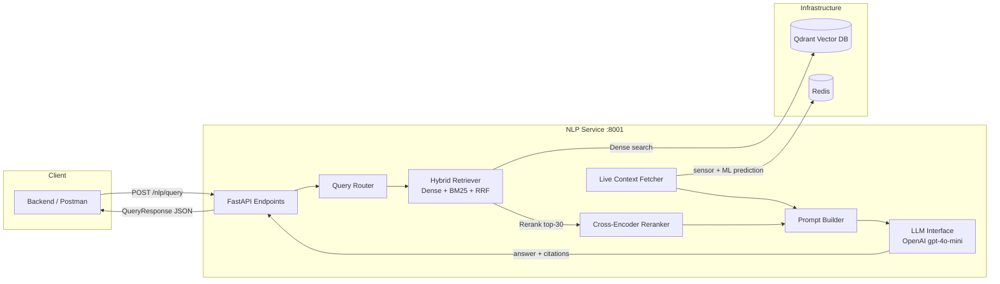

# Lapis AI — NLP/RAG Service


Service NLP/RAG (Retrieval-Augmented Generation) untuk monorepo Predictive Maintenance **Lapis AI**.
Menerima pertanyaan teknisi dalam Bahasa Indonesia, mencari konteks relevan dari dokumen pemeliharaan mesin
(laporan, manual, SOP), menggabungkannya dengan data sensor real-time, lalu menghasilkan jawaban beserta
citation dan rekomendasi aksi melalui LLM.

---

## Arsitektur



**Alur query end-to-end:**

1. **Query Router** — klasifikasi query ke mode (`general`, `machine_specific`, `historical`, `multi_machine`), ekstrak machine ID, keyword teknis, dan referensi waktu.
2. **Hybrid Retriever** — Dense search (multilingual-e5-base, 768d) + BM25 sparse search, digabung via Reciprocal Rank Fusion (RRF, k=60), menghasilkan top-30 kandidat.
3. **Cross-Encoder Reranker** — `ms-marco-MiniLM-L-6-v2` mererank top-30 → top-8 final chunks.
4. **Live Context** — Fetch data sensor real-time dari Redis (suhu, vibrasi, tekanan, RPM, prediksi ML, RUL).
5. **Prompt Builder** — Rakit system prompt + retrieved chunks + live context + chat history → `PromptPackage`.
6. **LLM** — OpenAI `gpt-4o-mini` menghasilkan jawaban terstruktur (ANALISIS → REKOMENDASI → REFERENSI) dengan fallback ke mock response.

---

## Struktur Direktori

```
nlp/
├── api/
│   ├── main.py              # FastAPI app entrypoint
│   ├── endpoints.py          # Route handlers (query, ingest, health)
│   ├── schemas.py            # Pydantic request/response models
│   └── citation.py           # Citation extractor & confidence scorer
├── chunking/
│   ├── base_chunker.py       # Base class & ChunkData dataclass
│   ├── maintenance_chunker.py # Section-based chunker untuk laporan
│   └── prose_chunker.py      # Semantic sliding window chunker
├── configs/
│   └── config.yaml           # Konfigurasi seluruh pipeline
├── data/
│   ├── raw/                  # PDF dokumen mentah (bind mount)
│   ├── processed/            # *.chunks.json hasil chunking
│   └── vector_db/            # Qdrant local storage (dev only)
├── embeddings/
│   ├── embedder.py           # EmbeddingModel (multilingual-e5-large)
│   ├── vector_store.py       # Qdrant client abstraction
│   └── run_pipeline.py       # Full embedding pipeline script
├── prompting/
│   ├── prompt_builder.py     # PromptBuilder & PromptPackage
│   ├── llm_interface.py      # LLMInterface (OpenAI ChatOpenAI)
│   └── live_context.py       # LiveContextFetcher (Redis → sensor data)
├── retrieval/
│   ├── query_router.py       # QueryRouter (mode classification)
│   ├── retriever.py          # HybridRetriever (Dense + BM25 + RRF)
│   └── pipeline.py           # RetrievalPipeline (orchestrator)
├── scripts/
│   └── download_models.py    # Pre-download HuggingFace models (Docker)
├── tests/
│   ├── evaluation.py         # RAGAS evaluation suite
│   └── _pre_docker_check.py  # Pre-build validation
├── Dockerfile.nlp            # Docker build file
├── requirements.txt          # Python dependencies
└── ingestion.py              # PDF ingestion pipeline
```

---

## Quick Start

### Prasyarat

- Python 3.12+
- Docker Desktop (untuk deployment)
- API key OpenAI

### Local Development

```bash
# 1. Clone dan masuk ke root monorepo
cd predictive-maintenance-monorepo

# 2. Buat virtual environment
python -m venv nlp/.venv
nlp/.venv/Scripts/activate    # Windows
# source nlp/.venv/bin/activate  # Linux/Mac

# 3. Install dependencies
pip install -r nlp/requirements.txt

# 4. Buat file .env di root monorepo
echo "OPENAI_API_KEY=sk-xxxx" > .env

# 5. Jalankan embedding pipeline (wajib sekali)
python -m nlp.embeddings.run_pipeline

# 6. Jalankan server
python -m nlp.api.main
```

Service akan berjalan di `http://localhost:8001`. Docs: `http://localhost:8001/nlp/docs`.

### Docker Deployment

```bash
# 1. Pastikan .env sudah ada di root monorepo (lihat bagian Environment)

# 2. Start infrastructure
docker compose up -d redis qdrant

# 3. Build dan start NLP service
docker compose build nlp
docker compose --profile app up -d nlp

# 4. Index data ke Qdrant (wajib, hanya sekali setelah deploy pertama)
docker exec lapis_nlp_engine python -m nlp.embeddings.run_pipeline

# 5. Verifikasi
curl http://localhost:8001/nlp/health
```

---

## API Endpoints

Semua endpoint berada di bawah prefix `/nlp`.

### `POST /nlp/query` — Query RAG Pipeline

Terima pertanyaan teknisi, return jawaban + citations.

**Request:**
```json
{
  "query": "Kapan saja M-01 dilakukan maintenance?",
  "machine_ids": ["M-01"],
  "session_id": "optional-session-id",
  "history": [
    {"role": "user", "content": "pertanyaan sebelumnya"},
    {"role": "assistant", "content": "jawaban sebelumnya"}
  ],
  "mode": "auto",
  "use_reranker": true,
  "use_hybrid": true
}
```

| Field | Type | Required | Default | Keterangan |
|:---|:---|:---|:---|:---|
| `query` | string | ✅ | — | Pertanyaan teknisi (1–2000 karakter) |
| `machine_ids` | string[] | ❌ | null | Filter mesin, e.g. `["M-01"]` |
| `session_id` | string | ❌ | null | ID sesi percakapan |
| `history` | ChatMessage[] | ❌ | null | Riwayat chat (max 6 pesan) |
| `mode` | string | ❌ | `"auto"` | `auto` / `general` / `machine_specific` |
| `use_reranker` | bool | ❌ | `true` | Aktifkan cross-encoder reranking |
| `use_hybrid` | bool | ❌ | `true` | Aktifkan hybrid Dense + BM25 |

**Response:**
```json
{
  "query_id": "QRY-20260529062402-2DC0",
  "query": "Kapan saja M-01 dilakukan maintenance?",
  "answer": "## ANALISIS\nMesin M-01 telah dilakukan pemeliharaan pada...",
  "action_suggestions": ["[PREVENTIF] Lakukan inspeksi rutin..."],
  "citations": [
    {
      "source_doc": "Laporan_M-01_November_2025.pdf",
      "page": 0,
      "chunk_id": "Laporan_M-01_November_2025__chunk_0001_7c5cab",
      "doc_type": "maintenance_report",
      "relevance": -4.8137
    }
  ],
  "live_context_used": true,
  "live_context_data": [
    {
      "machine_id": "M-01",
      "status": "healthy",
      "temperature_c": 68.3,
      "vibration_mms": 0.48,
      "pressure_psi": 100.8,
      "rpm": 2484.0,
      "ml_prediction": "normal",
      "rul_days": 46,
      "active_alerts": [],
      "data_source": "mock"
    }
  ],
  "mode": "machine_specific",
  "provider_used": "openai",
  "model_used": "gpt-4o-mini",
  "confidence": "high",
  "latency_ms": 9382,
  "session_id": null,
  "timestamp": "2026-05-29T06:24:11.675006+00:00"
}
```

---

### `POST /nlp/ingest` — Ingest Dokumen Baru

Terima dokumen dari Backend dan proses di background (copy → chunk → embed → upsert).

**Request:**
```json
{
  "document_id": "DOC-001",
  "file_path": "/app/nlp/data/raw/Laporan_M-01_Januari_2026.pdf",
  "filename": "Laporan_M-01_Januari_2026.pdf",
  "doc_type": "maintenance_report"
}
```

> **Catatan:** File harus sudah ada di path yang diakses container (shared volume). Bukan multipart upload.

**Response:**
```json
{
  "document_id": "DOC-001",
  "status": "accepted",
  "message": "Dokumen 'Laporan_M-01_Januari_2026.pdf' diterima dan sedang diproses",
  "chunks_count": null,
  "doc_type": null,
  "processed_at": null,
  "error_message": null
}
```

---

### `GET /nlp/health` — Health Check

**Response:**
```json
{
  "status": "ok",
  "vector_db": "ok",
  "embedding_model": "loaded",
  "llm_provider": "openai",
  "llm_status": "ok",
  "chunks_indexed": 535,
  "uptime_seconds": 120.5,
  "version": "1.0.0"
}
```

| Field | Values | Keterangan |
|:---|:---|:---|
| `status` | `ok` / `degraded` / `error` | `degraded` jika Qdrant collection tidak ada |
| `embedding_model` | `loaded` / `not_loaded` | Lazy load — `not_loaded` sampai query pertama |
| `llm_status` | `ok` / `mock` | `mock` jika `OPENAI_API_KEY` tidak di-set |

---

## Environment Variables

Buat file `.env` di **root monorepo** (`predictive-maintenance-monorepo/.env`):

```env
# === WAJIB ===
OPENAI_API_KEY=sk-xxxx                              # LLM provider

# === OPSIONAL (ada default) ===
REDIS_URL=redis://:lapis_redis_secret@redis:6379     # Live context (mock jika kosong)
REDIS_PASSWORD=lapis_redis_secret                    # Password Redis
QDRANT_URL=http://qdrant:6333                        # Qdrant server (Docker only)
NLP_HOST=0.0.0.0                                     # default: 0.0.0.0
NLP_PORT=8001                                        # default: 8001
```

| Variable | Diperlukan | Default | Keterangan |
|:---|:---|:---|:---|
| `OPENAI_API_KEY` | ✅ | — | Tanpa ini, LLM fallback ke mock response |
| `REDIS_URL` | ❌ | *(tidak di-set)* | Jika kosong → live context pakai mock data |
| `QDRANT_URL` | ❌ | *(tidak di-set)* | Jika di-set → koneksi Qdrant server. Jika kosong → pakai local file mode |

---

## Model & Konfigurasi

Semua konfigurasi ada di `nlp/configs/config.yaml`.

### Embedding Model

| Parameter | Nilai |
|:---|:---|
| Model | `intfloat/multilingual-e5-base` |
| Dimensi | 768 |
| Fallback | `sentence-transformers/paraphrase-multilingual-mpnet-base-v2` |
| Batch size | 32 |
| Query prefix | `query: ` |
| Passage prefix | `passage: ` |

### Retrieval

| Parameter | Nilai |
|:---|:---|
| Dense top-k | 20 |
| BM25 top-k | 20 |
| RRF k | 60 |
| After RRF top-k | 30 |
| Final top-k (setelah rerank) | 8 |
| Reranker | `cross-encoder/ms-marco-MiniLM-L-6-v2` |

### LLM

| Parameter | Nilai |
|:---|:---|
| Provider | OpenAI |
| Model | `gpt-4o-mini` |
| Max tokens | 4096 |
| Temperature | 0.7 |
| Fallback | Mock response (deterministic) |

### Vector Database

| Parameter | Nilai |
|:---|:---|
| Provider | Qdrant |
| Collection name | `lapis_ai_chunks` |
| Mode (local) | File-based (`nlp/data/vector_db/qdrant`) |
| Mode (Docker) | Server via `QDRANT_URL` |

---

## Chunking Strategy

Service menggunakan dua strategi chunking:

| Strategi | File | Keterangan |
|:---|:---|:---|
| **Section-based** | `maintenance_chunker.py` | Parse section laporan (Ringkasan, Detail Event, Rekomendasi) menjadi chunk terstruktur per mesin |
| **Semantic sliding window** | `prose_chunker.py` | Untuk dokumen naratif (manual, SOP) — sliding window dengan overlap 20%, split di batas kalimat |

Parameter chunking (dari `config.yaml`):
- Target size: **200** karakter
- Min size: **50** karakter
- Max size: **400** karakter
- Overlap: **20%**
- Similarity threshold: **0.75**

---

## Docker

### Build Image

```bash
docker compose build nlp
```

Image menggunakan `python:3.12-slim` dengan layered dependency installation:
1. PyTorch (cached layer, ~2GB)
2. Sentence-Transformers + Transformers
3. Sisa requirements.txt
4. Pre-download HuggingFace models (~1.2GB, cached di image)

### Service Dependencies (docker-compose.yml)

```
nlp ──depends_on──► redis (healthy)
    ──depends_on──► qdrant (healthy)
```

### Volumes

| Volume / Mount | Path di Container | Keterangan |
|:---|:---|:---|
| `qdrant_data` (named) | `/qdrant/storage` | Data Qdrant server (persistent) |
| `./nlp/data/raw` (bind) | `/app/nlp/data/raw` | PDF dokumen mentah |
| `./nlp/data/processed` (bind) | `/app/nlp/data/processed` | Chunks JSON |

### Port Mapping

| Service | Host | Container |
|:---|:---|:---|
| NLP | 8001 | 8001 |
| Qdrant | 6333 | 6333 |
| Redis | 6380 | 6379 |

---

## Testing

### Health Check

```bash
curl http://localhost:8001/nlp/health
```

### Query (PowerShell)

```powershell
Invoke-RestMethod -Method POST `
  -Uri "http://localhost:8001/nlp/query" `
  -ContentType "application/json" `
  -Body '{"query": "Apa saja emergency event pada mesin M-01?", "machine_ids": ["M-01"]}'
```

### Query (curl)

```bash
curl -X POST http://localhost:8001/nlp/query \
  -H "Content-Type: application/json" \
  -d '{"query": "Apa saja emergency event pada mesin M-01?", "machine_ids": ["M-01"]}'
```

### Interactive API Docs

- Swagger UI: `http://localhost:8001/nlp/docs`
- ReDoc: `http://localhost:8001/nlp/redoc`

---

## Catatan Penting

1. **Stateless service** — NLP service tidak menyimpan riwayat chat. Backend harus mengirim `history` di setiap request query.

2. **Relevance score negatif** — Cross-encoder reranker menghasilkan raw logit score (range -15 sampai +5), bukan cosine similarity 0–1. Score -5 = relevansi moderat.

3. **Embedding model lazy load** — Model baru di-load saat query pertama (bukan saat startup). Health check akan menunjukkan `embedding_model: "not_loaded"` sampai query pertama masuk.

4. **Qdrant mode** — Di local dev, Qdrant menggunakan file-based storage (single process). Di Docker, menggunakan server mode via `QDRANT_URL` yang mendukung concurrent access.

5. **Live context mock** — Jika `REDIS_URL` tidak di-set atau Redis tidak terkoneksi, live context akan menghasilkan mock data dengan `data_source: "mock"`.
